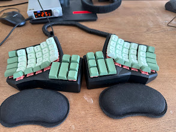
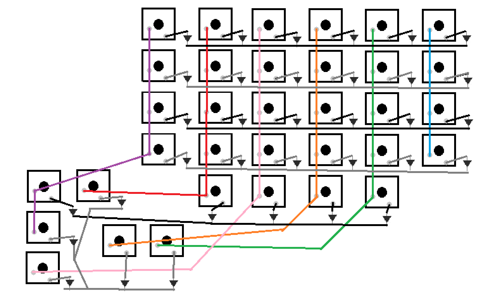
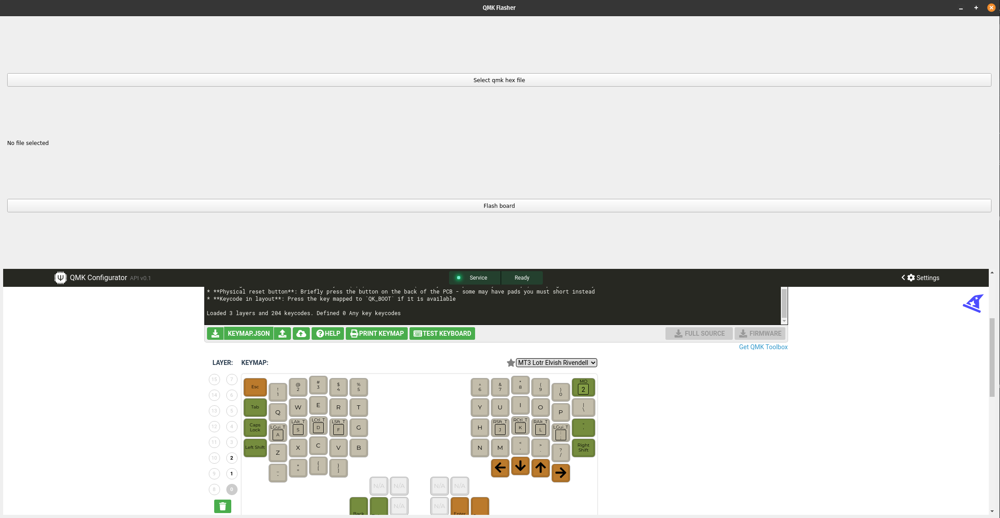

# Dactyl-cc build guide

The following is a build / process guide for building the Dactyl-cc, with a few modifications of my own.

The primary motivation for this guide is for future builders looking for a complete guide from A-Z on how to put this thing together and get the software up and running.

As when i was building my own i found that the necessary information was really scattered / poorly done. This is not to say that there are no good build guides or information out there, but especially for custom keyboard beginners (like myself) it can be a little intimidating / cumbersome to piece the information, i hope the following will be of help.

## Printing the body & plates

So first things first, you will need to get hold of somebody who can 3D print the main body and the backplates of the keyboard. I decided to go with and online service (insert link to JLCPCB) because i wanted to try out some fancy 3D print materials from SLA printing, however this was probably way overkill. A friend of mine who is was doing the build alongside with decided to have the print done with more tradtional PLA type print, and not only did this print go WAY faster it was also WAY cheaper. Even though the final quality of the SLA print is nicer, by a minor margin, i would probably not go with SLA print were i to do this again. It also turned out that the material itself posed some problems since it was not possible to melt the threads in as the material would crumble instead of melt when exposed to heat.

All the 3D parts can be found in the STL folder, which contains the original dactyl-cc modified with holes for RJ9 connector (yes we are going to be using RJ9, not shitty 3mm audio cables), a hole for a USB-C connector and a wall mounted arduino-pro mircro case. (insert link to the thingyverse arduino mount). Also the backplate has been made thicker to meet JLCPCB print requirements.

(insert image of bare case)

## part notes

The following are the parts you will need beside the 3D printed parts.

| QUANTITY | ITEM                                | LINK                                                                                                                                                                                                                                        | NOTE                                  |
|----------|--------------------------------------|---------------------------------------------------------------------------------------------------------------------------------------------------------------------------------------------------------------------------------------------|---------------------------------------|
| 2x       | Arduino Pro Micro (knockoff)           | [Amazon Link](https://www.amazon.de/-/en/gp/product/B0CMXQWCTC/ref=ox_sc_act_image_2?smid=AE3E5WPQSSR6E&psc=1)                                                                                                                                          |                                       |
| 68x       | Keycaps                                | [Amazon Link](https://www.amazon.de/-/en/gp/product/B096581229/ref=ewc_pr_img_7?smid=A111ZR18PX26NO&psc=1)                                                                                                                                          | Choose based on preference           |
| 68x       | Key switches                           | [Amazon Link](https://www.amazon.de/-/en/Mechanical-Keyboard-Switches-Barebones-Rosewood/dp/B0D8KB4RPZ?crid=3QRLGPEONSGV7&dib=eyJ2IjoiMSJ9.SAopYxMDciVUuH5ivLoZ2fbS7gaT5hxprH6n2bZ0mZ8LwCdAiD-TPbOz2WjDqjGQtCb5QmFfTlsYVLJKQI3zUK3aurWk0LIUbwAcy3SX2B0DgObcqG9RbOkdfEBHNOyETx0CuDn_CFLOKsJ08UWKFHwwh9DsNfZhbDZ6VzE8TaON4axkLPJKF8EwNAK_0-CeeFR0Z2MJl73N92RrzUiprRQdTdFGN3Sq-HJY6Qi0g2Q.CXT_b_UCrlFmzYoUZBchxeKcqxGq2b7Tks5-nDLCUeA&dib_tag=se&keywords=akko+rosewood&nsdOptOutParam=true&qid=1734976848&sprefix=akko+rosewood%2Caps%2C113&sr=8-1) | Ensure enough for both sides         |
| 2x       | RJ9 Female Connector Box               | [Amazon Link](https://www.amazon.de/-/en/gp/product/B0DQ8P1GHF/ref=ox_sc_act_image_1?smid=A3TG06TXX9IODL&psc=1)                                                                                                                                          | Comes in bags of 10+                 |
| 1x       | RJ9 Cable                              | [Amazon Link](https://www.amazon.de/-/en/POPESQ%C2%AE-A3639-Telephone-Cable-Black/dp/B08R2ZRWGN?crid=2ZU2IKUIGCYTS&dib=eyJ2IjoiMSJ9.vdI6Z1P7mQvkyhM2AjbiODe7OQBQa9WOBqTtpfZBsXrHQV38cgDiLAm-p85mmhXKGVwNkgkiDdZaxJ17EucSL2vXxkLl-GCPQX7P-O49PgBCyY8VcYHwOAVeH61sDiI7nMpR_yrdcYVcyruXGlTpcxuHYm2p-BOkO1rrkQayZt_lrHR59dsb_IhiVUKJYLP5524kp-K1MiR5FgkRm7CvI8G2DasEtEO5gF_4y58R4hM.n1xiO_2tcN0BSBhZz5NuPchM7zEX-nkk7AJNBP5GdeE&dib_tag=se&keywords=rj9+1m+cable&nsdOptOutParam=true&qid=1734976997&sprefix=rj9+1m+cab%2Caps%2C95&sr=8-3) | Standard cable                       |
| 2x       | Reset Buttons                          | [Amazon Link](https://www.amazon.de/-/en/gp/product/B0BQ3CKVMT/ref=ox_sc_act_image_3?smid=A2LZP99XORN4MN&psc=1)                                                                                                                                          | Optional but useful for flashing     |
| 100x     | 1N4148 Diodes                          | [Amazon Link](https://www.amazon.de/-/en/gp/product/B099PPQ7YN/ref=ox_sc_act_image_4?smid=A1KWICEO3X4YTG&psc=1)                                                                                                                                          |                                       |
| 1x       | Threaded 3M Inserts                    | [Amazon Link](https://www.amazon.de/-/en/gp/product/B0CRHMV56P/ref=ox_sc_act_image_5?smid=A1CN76T7RK0FRJ&psc=1)                                                                                                                                          |                                       |
| 1x       | M3 flathead screws                    | (Insert Link)                                                                                                                                          |                                       |
| 1x       | Wires                                  | (Insert Link)                                                                                                                                                                                                                                  |                                       |
| -        | Soldering Gear and Multimeter          | (Insert your own gear)                                                                                                                                                                                                                           | Small pliers and wire stripper needed|
| 1x       | USB-C to USB-A Cable                   | (Insert Link)                                                                                                                                                                                                                                   | For connecting Arduino to computer   |
| 1x       | USB-C male to USB-C female extender    | (Insert Link)                                                                                                                                                                                                                                   | Optional if you wanna have a detachable cable   |
| 2x       | Wrist rests                            | (Insert Link)| |
| 1x       | Anti-slip pads                         | (Insert Link)| |
| 1x       | Anti-slip pads                         | (Insert Link)| |

## Pre soldering

Before you jump into soldering everything up, it really makes everything easier if you prepare your diodes and wires ahead of time.

There are different options on how to do the cable wiring, but tbh the easiest, and probably fastest, is to just make small pieces of wire going from keyswitch to keyswitch. Pre-soldering the wires and pins also really helps.

For the diodes make sure you understand that they are directional, meaning you can wire them the wrong way around. Normally these diodes will have black sripe on them, make sure this this end points AWAY from the pin you are soldering it to.

It really helps to prepare the diodes with  cutting down the lengt of the side that is going to be solder to the pin and making a small hook such that you can easily solder it to the pin, also making a hook on the other end help hooking the diodes together when soldering the rows.

Prepare these things before you start to solder.

(insert image of hooking diodes and pieces of wiring)

## Wiring

My experience with this build was that there are some contradicting information in regards to the wiring of this keyboad out there, i tried several, and the one that ended up working was one found in a [reddit](https://www.reddit.com/r/ErgoMechKeyboards/comments/1db3k5u/just_finished_my_first_dactylcc_build_inc_wiring/#lightbox) post.

I have created a, in my mind, more simple wiring diagram, which is shown below.

The wiring diagram shown is for the left side of the keybaord, but mirror it exactly the same for the right side. However please **beaware** that the wiring for the Arduinos is **not** the same, note that the columns for the right side is flipped compared to the left, the row placements are the same, but the columns pins are switched.

## qmk_flahser tool

There is a simple flasher tool included with the repo, it requires PyQt5 and AVRdude to be installed.

avrdude can be installed for different OS by following the instructions in the [repo](https://github.com/avrdudes/avrdude), PyQt5 can be installed through pip.

Starting the tool can be done with.

`python qmk_config/qmk_flasher.py`

The tool is meant to be used to make it easier to flash the keyboard and make changes, as this can be somewhat cumbersome otherwise. Opening the tool opens a window with the QMK configurator set up for the dactyl-cc.

The embeded website can be used as the normal QMK configurator website, the json layout download and the firmware download (downloads the hex file needed to flash) button downloads directly to the qmk_config folder.

(trying to figure out how to have it download and upload the json automatically)

Selecting the hex file for flashing can be done through the button "Select qmk hex file.

For the default layout that is shipped with this repo, the boards can be put into boot mode by tabbing the upper most right key on the right keyboard + the upper most left key on the left keyboard. Following that hit the "Flash board" and a voila, the boards should flash!

### First time flashing

The first time that the arduinos needs flashing the workflow will be a little different than described above, this is due to the arduinos not actually having the qmk firmware installed yet, which means we will need to manually get that on first.

Though i have not tried it, the tool should be able to do this aswell, the only diffenece should be that the board needs to be put in BOOT mode by breifly shorting the GND + RST pins on the arduino. By doing so should keep the board in BOOT for roughly 8 seconds, in this time click "Flash board".

The first time you will need to do the above described, on both boards.

## usefull cmds

qmk compile -kb clueboard/66/rev3 -km default

avrdude -p m32u4 -c avr109 -P /dev/ttyACM0 -U flash:w:/path/to/yourfirmware.hex:i